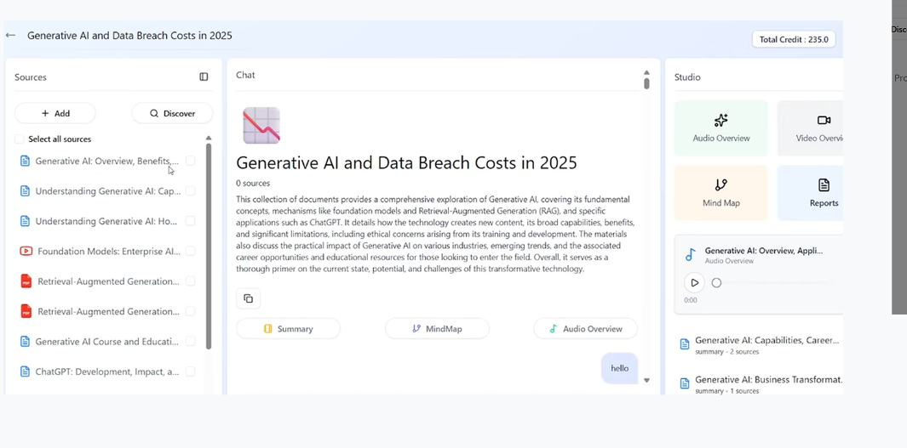

Overview / Explanation video: https://drive.google.com/file/d/1YW3JpBKrfsxo_AJdIwXTLQ8kKWlMFtih/view?usp=sharing



# NotebookLMClone

Comprehensive local notebook + RAG + assistant demo. This README explains the project, how files are handled (uploads, Drive, URLs, generated images), how the chat remembers conversations, environment variables, and how to run and extend the project.


**Features**
- Import documents from URL, Google Drive, uploads, and YouTube links.
- Extract text, generate summaries, FAQs, study guides, mind maps, and briefing docs.
- Generate cover images for notes using an external image workflow and save them under `public/notes/`.
- RAG-enabled chat over document content with persistent chat history.

## Architecture (high level)

- Frontend (Vite + React) — UI, file picking, chat client, and calls backend REST/WebSocket endpoints.
- Backend (Express + LangChain/LangGraph) — ingestion, pipelines, image generation, chat pipeline, and static file serving.
- Vector DB (Pinecone or similar) — stores embeddings of document chunks for retrieval.
- Storage — temporary uploads at `tmp/uploads`, OS temp for Drive/PDF processing, final generated assets in `public/notes/`.

## File handling: how sources flow through the system

- Uploads (browser → server):
	- Frontend uploads files to `POST /api/v1/notes` using `multer` (disk storage). Files are written to `tmp/uploads` with unique names. (See [backend/src/app/http/controllers/notes/repository/createNote.ts](backend/src/app/http/controllers/notes/repository/createNote.ts#L1-L260)).
	- The loader extracts text from uploads: PDFs use `PDFLoader` (filesystem path required); text files are read with `fs.readFile`. After extraction uploads are removed (`fs.unlink`). (See [backend/src/app/services/notes/loader.ts](backend/src/app/services/notes/loader.ts#L1-L200)).

- Google Drive: downloaded via Drive API.
	- Google Docs are exported as plain text. PDFs are streamed, converted to a Buffer, written to a temp PDF file, parsed, and the temp file is deleted. (See [backend/src/app/helpers/googleDrive.ts](backend/src/app/helpers/googleDrive.ts#L1-L200)).

- Web URLs / YouTube: fetched and parsed via Cheerio (`CheerioWebBaseLoader`). Only page text/metadata are extracted (no video binary downloads). (See [backend/src/app/services/notes/loader.ts](backend/src/app/services/notes/loader.ts#L1-L200)).

- Image generation: prompt generated from note content, sent to an external image API. Supported response shapes:
	- Direct binary image (content-type image/*): written directly to `public/notes/<noteId>.png`.
	- JSON with a remote `url`: backend fetches that URL and writes bytes to `public/notes/<noteId>.png`.
	- JSON with base64 fields (`b64_json` / `image.base64`): decoded and written to file.
	- Express serves `public` at `/public` so saved images are available at `/public/notes/<noteId>.png`. (See [backend/src/app/services/notes/generateImage.ts](backend/src/app/services/notes/generateImage.ts#L1-L200) and [backend/src/app/bootstrap/express/expressServer.ts](backend/src/app/bootstrap/express/expressServer.ts#L1-L120)).

## Binary data: streams, ArrayBuffer, Buffer, base64 — simple explanation

- Streams: used to download large remote files (Drive PDFs) without loading everything into memory.
- Buffer (Node): the standard binary container used to accumulate stream chunks and write files (`Buffer.concat` of chunk arrays).
- ArrayBuffer: returned by `fetch().arrayBuffer()` when downloading via fetch; converted to Node `Buffer` before saving.
- base64: text-friendly encoding used when APIs return binary inside JSON. Decode with `Buffer.from(base64, 'base64')`.

Why we use each:
- Streams for memory efficiency on large downloads.
- Buffers for Node file IO.
- base64 for compatibility with JSON-based APIs.

## How the conversational memory works (simple)

- Each chat turn (user message and AI reply) is saved to Mongo in the `Chat` document (`Chat.messages[]`). Schema: [backend/src/app/bootstrap/models/chatSchema.ts](backend/src/app/bootstrap/models/chatSchema.ts#L1-L120).
- REST chat flow: `POST /api/v1/chats` runs the QA/RAG pipeline and then appends both the user and AI messages to the `Chat` document. (See [backend/src/app/http/controllers/chat/chatController.ts](backend/src/app/http/controllers/chat/chatController.ts#L1-L200)).
- WebSocket flow: frontend can send `chat:message` to the socket server and the server runs the same chat pipeline and emits `chat:response` (see [backend/src/app/http/websockets/chatHandler.ts](backend/src/app/http/websockets/chatHandler.ts#L1-L200)).
- Important detail: saved chat turns are used for display and persistence; the current RAG pipeline primarily uses vector DB retrieval of document content (not the entire chat array) to build LLM context. If you want the LLM to use past chat turns as context, include recent messages into the prompt before invoking the pipeline.

## Environment variables (important)
- `PORT` — backend port
- `MONGODB_URI` — MongoDB connection
- `OPENAI_API_KEY` — OpenAI API key (LLM)
- `FIRE_WORKS_API_KEY` — image workflow API key
- `FIREWORKS_IMAGE_WORKFLOW_URL` — optional image endpoint override
- `COOKIE_KEY`, `JWT_TOKEN_KEY`, `REFRESH_TOKEN_KEY` — auth/session secrets
- `REACT_APP_URL` — frontend origin for CORS
- `TAVILY_API_KEY` — optional web-search retriever key

Check `.env.example` in the backend for the full list.

## Run locally (quick)

1. Backend

```bash
cd backend
npm install
cp .env.example .env   # set keys
npm run dev
```

2. Frontend

```bash
cd frontend
npm install
npm run dev
```

3. Create a notebook from UI, add sources, or use the API to POST files/drive links/URLs.

## Extending / Next steps (suggestions)

- Add server-side TTS: create `generateAudio(text, noteId)` to save MP3 to `public/notes/<noteId>.mp3` and update the DB; frontend can play via `<audio>`.
- Offload assets to object storage (S3) if running multiple instances or needing persistent cross-instance storage.
- Implement semantic chat memory: store chat-message embeddings in the vector DB and retrieve relevant past turns to enrich prompts.

## Troubleshooting

- PDF processing errors: ensure `pdf-parse` is installed in `backend` (the loader warns if missing).
- Image API errors: check `FIRE_WORKS_API_KEY` and `FIREWORKS_IMAGE_WORKFLOW_URL`.
- Static files 404: ensure `public/notes/<noteId>.png` exists and server serves `/public` (see express server).

## Files referenced (quick map)
- `backend/src/app/services/notes/generateImage.ts` — image generation and save.
- `backend/src/app/services/notes/loader.ts` — extract text from URL, Drive, and uploads.
- `backend/src/app/helpers/googleDrive.ts` — Drive download + PDF temp file handling.
- `backend/src/app/http/controllers/notes/repository/createNote.ts` — upload entrypoint.
- `backend/src/app/http/controllers/notes/docsController.ts` — upload multiple files and note docs controller.
- `backend/src/app/http/controllers/chat/chatController.ts` — REST chat endpoint and persistence.
- `backend/src/app/http/websockets/chatHandler.ts` — WebSocket chat live flow.

---

If you want, I can: add the banner image file into the repo for you (please provide the image file), wire server-side TTS, or change the chat pipeline to include recent chat turns. Which would you like me to do next?

